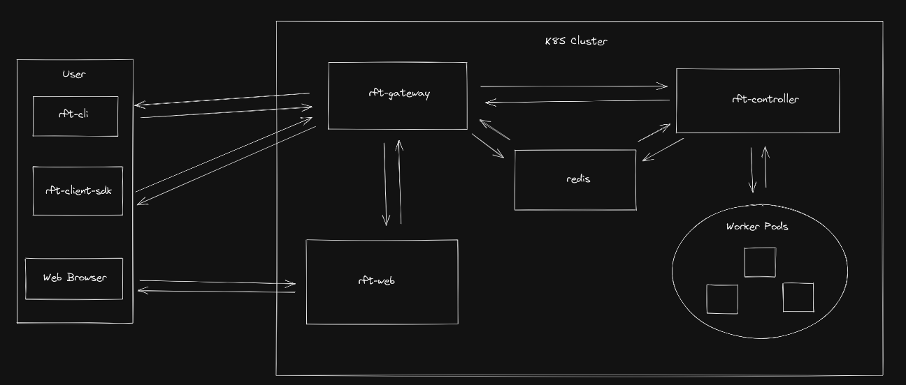

# rft

## Development Priorities

- Worker SDK (Python) - Used for sourcing rft data in jobs, i.e. `rft.get_param("start_date")`
- Move rft components to Helm chart, use Skaffold (or similar tools) for local development rather than running outside of the cluster
- Clean up error handling throughout the service
- Standardize on logging library/format, improve logging throughout project

## Architecture



## Developing Locally

Create a local Kind cluster and Docker registry. There's a script for automating this:
```
./create-kind-cluster.sh
```

Deploy/Upgrade the Helm chart:
```
cd rft-chart/

# For first time installation:
helm install rft .

# For upgrading:
export REDIS_PASSWORD=$(kubectl get secret --namespace "default" rft-redis -o jsonpath="{.data.redis-password}" | base64 --decode)
helm upgrade rft --set redis.auth.password=$REDIS_PASSWORD .
```

When making changes to the controller or gateway, you'll need to build/push images
to the local registry. There's a `deploy.sh` script which automates this behavior and restarts the
deployment pickup the new image.
```
# Using deploy.sh
./deploy.sh -c controller
./deploy.sh -c gateway

# Must be ran from the root of the repository
docker build . -f rft-controller/Dockerfile -t localhost:5000/rft-controller:latest
docker build . -f rft-gateway/Dockerfile -t localhost:5000/rft-gateway:latest

docker push localhost:5000/rft-controller:latest
docker push localhost:5000/rft-gateway:latest
```

Expose the gateway service:
```
kubectl port-forward --namespace default svc/rft-gateway-svc 8000:8000
```

At this point, you have a working rft deployment. To interact, you can build the CLI and use it.
```
cargo build --bin rft-client
target/debug/rft-client run -f test.py -p start_date=1980,1990,2000 end_date=2020,2025,2030 --format pairs
```